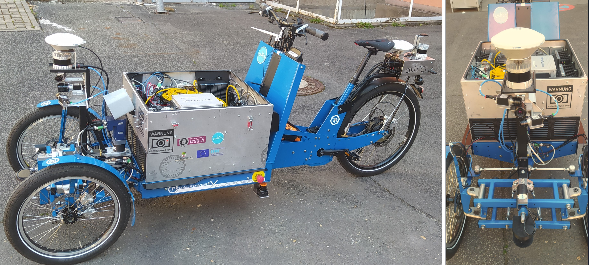
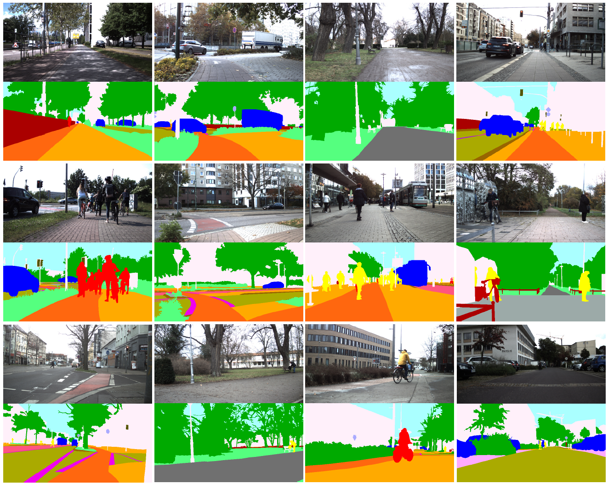
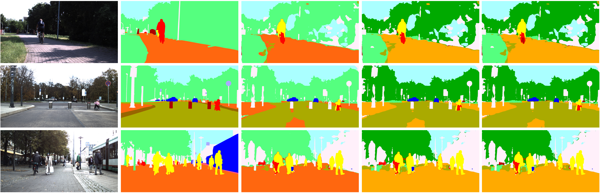

# Aura Dataset - A BikePerception Dataset 

**A vision dataset for semantic segmentation and object detection recorded from a bike's perspective.**

This repository provides sample data and code for working with a custom dataset focused on urban mobility and perception tasks from the viewpoint of a bicycle. It includes data for **semantic segmentation** and **bounding box detection**, a TensorFlow-based training pipeline, and utilities for visualization.

> 📧 **Note**: Only sample data is included here. To request access to the full dataset for academic or research purposes, please contact:  
> [stefan.sass@ovgu.de](mailto:stefan.sass@ovgu.de)  
> [markus.hoefer@ovgu.de](mailto:markus.hoefer@ovgu.de)

---

## 📸 Sensor Setup

The dataset was recorded from a mobile sensor platform mounted on a cargo bike, capturing urban, park, and pedestrian areas.
It reflects the unique perspective and challenges of micromobility in diverse environments.




## 🗂️ Folder Structure

```
├── dataset
│   ├── bb                  # Bounding box data
│   │   ├── train_val/
│   │   └── test/
│   └── semantic            # Semantic segmentation data
│       ├── train_val/
│       └── test/
│
├── training
│   ├── bb/                 # Training scripts and saved models for bounding box detection
│   └── semantic/           # Training scripts and saved models for semantic segmentation
│
├── utils
│   ├── bb_viewer.py        # Draw bounding boxes on images 
│   └── semantic_viewer.py  # Visualize semantic segmentation 
│   └── classes.py          # Class descriptions for bb/semantic

```

## 🧠 Tasks

### Semantic Segmentation

- Pixel-wise classification of urban scenes from the cyclist's point of view.

- Includes classes like pedestrians, cyclists, vehicles, infrastructure, etc.

- Ground truth provided as annotated label images.




### Bounding Box Detection

- Object detection in 2D using bounding boxes.

- Useful for detecting dynamic agents and static objects in shared mobility spaces.


## 🔬 Baseline Models

Baseline models are provided using TensorFlow. Each task comes with:

- Custom dataloaders

- Model architecture

- Training and testing scripts

- Pretrained models 

You can find them under:

- training/semantic/ for semantic segmentation

- training/bb/ for bounding box detection

### Bounding Boxes:


### Semantic:


| **Class Granularity**                 | **mPA [%]** | **mIoU [%]** |
|--------------------------------------|-------------|--------------|
| 25 classes (all individual labels)   | 67.9        | 48.07        |
| 19 classes (partially merged)        | 69.36       | 57.13        |
| 13 classes (strongly merged)         | 76.7        | 67.2         |



Qualitative comparison of semantic segmentation results. Each column shows one example. The first row contains the original input images. The second row shows the ground truth annotations. 
Rows three to five show the predictions from models trained with 13, 19, and all 25 classes, respectively. 


## 📩 Requesting Full Dataset

This repository contains only sample data. For access to the complete dataset (size ~5.9 GB), please contact:

    stefan.sass@ovgu.de

    markus.hoefer@ovgu.de

Please include your institutional affiliation and intended use (academic or research only).


## 📄 License

This dataset is provided for academic and research use only. 
Redistribution or commercial usage is not permitted without explicit permission.


## 🔗 Citation

A citation entry will be added here once the corresponding paper or technical report is published.